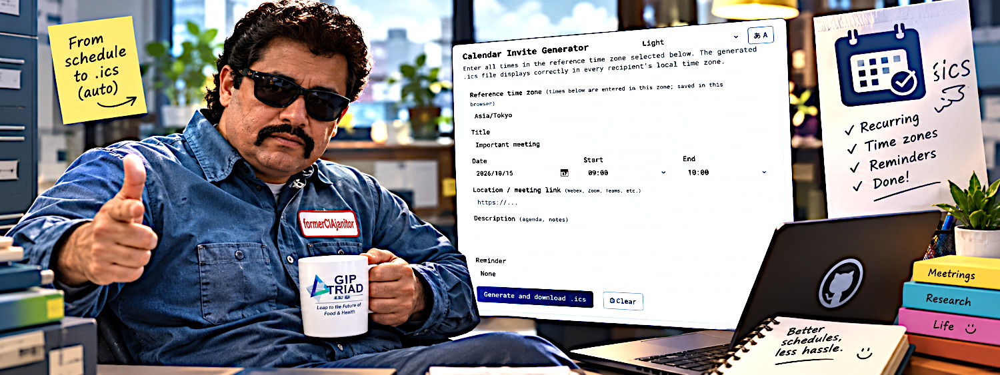
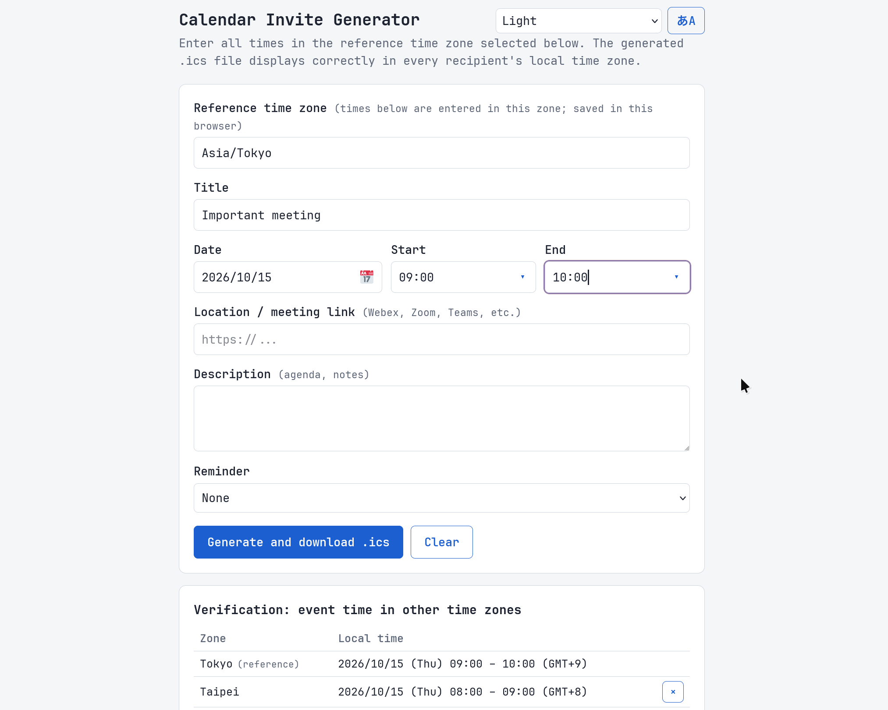

<h1 align="center">

</h1>
<h3 align="center" style="margin: 0; margin-top: 0;">
Calendar Invite Generator — never miss your meeting at 2 am again.
</h3>

---

## Screenshot

## Usage

Simply open it at https://gip-triad.github.io/mc-run-sheet/ , enter the event time in a reference timezone, add the meeting details, and generate the .ics file.

